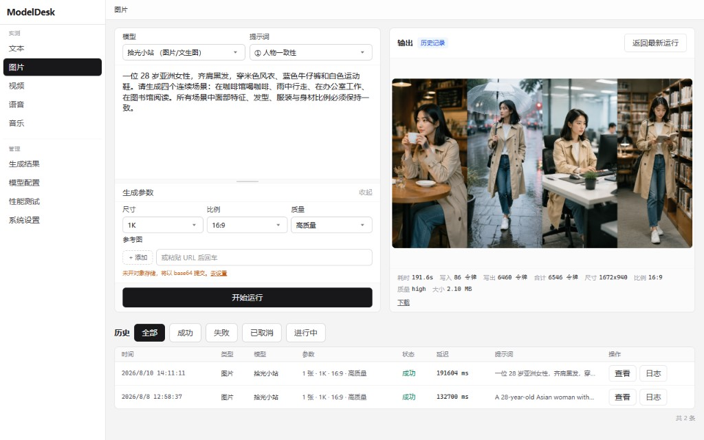
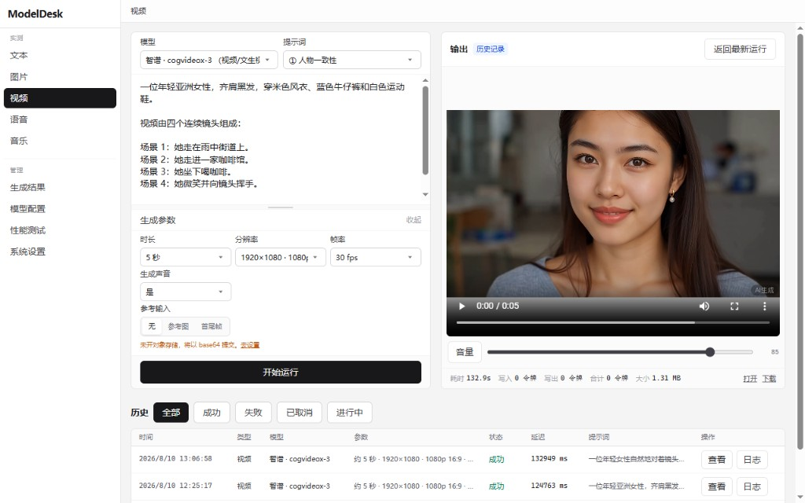
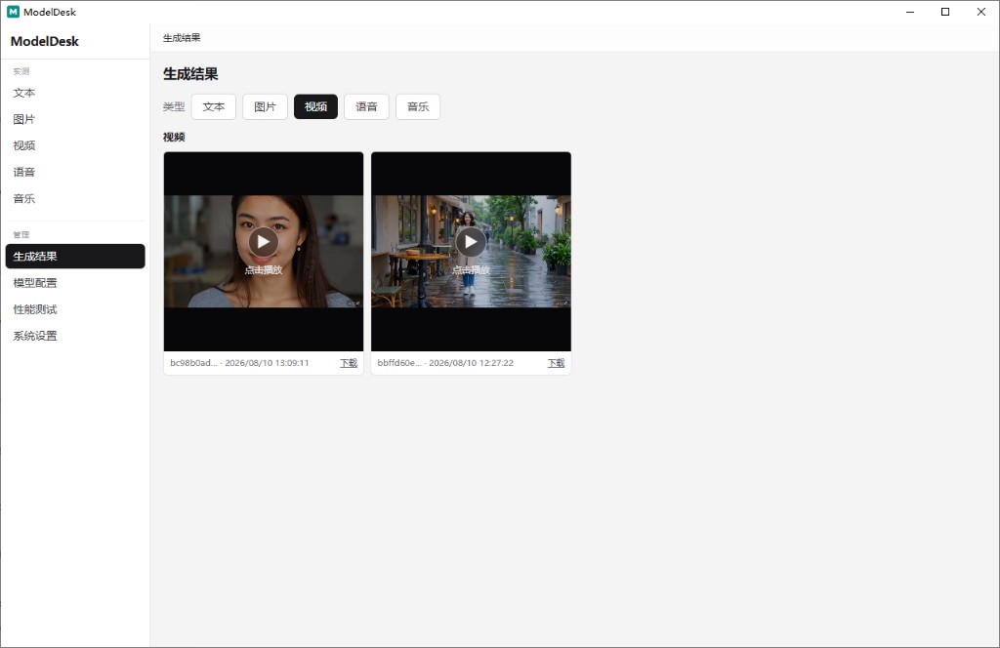
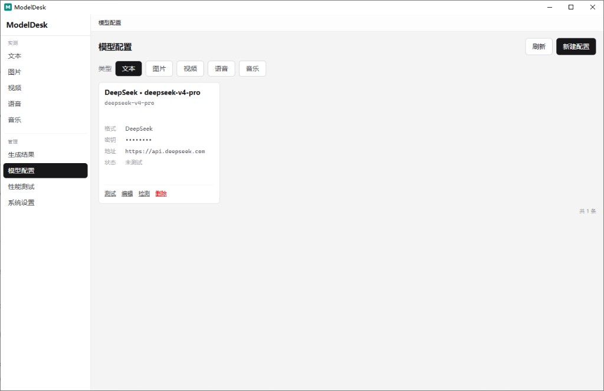

# ModelDesk

**个人本机多业务中心：** 配好自己的 Key，在同一处跑通文 / 图 / 音 / 视；业务脚本再经本机 Gateway 稳定调用——数据与密钥都留在你自己的机器上。

```text
配置模型 → 按模态实测 → 本机 Gateway / CLI / MCP 给业务调 → 产物可回看
```

| 下载 | 地址 |
|------|------|
| **Windows 安装包**（推荐国内） | [Gitee · v0.2.2](https://gitee.com/gaoshuteacher/modeldesk/releases/tag/v0.2.2) |
| **Win / macOS 全量包** | [GitHub · v0.2.2](https://github.com/gao-shu/modeldesk/releases/tag/v0.2.2) |
| **Gitee 源码** | [gaoshuteacher/modeldesk](https://gitee.com/gaoshuteacher/modeldesk) |

> Gitee 单附件约有 **100MB** 上限，发行版目前放 **Windows `.exe`**；macOS `.dmg` 请从 GitHub 下载。

**新手：** [5 分钟跑通第一张图](./docs/quickstart-first-image.md) · **操作手册（图文）：** [docs/user-guide.md](./docs/user-guide.md)

## 界面预览

**图片实测** · 提示词预设「人物一致性」· 参数 / 结果 / 耗时 Token / 历史同屏



**视频实测** · 智谱 CogVideoX · 时长 / 分辨率 / 帧率 / 有声 · 本机可播可下



**生成结果** · 按模态筛选 · 视频缩略图 · 一键下载



**模型配置** · Key 磁盘加密 · 分类型筛选 · 连通性测试一键摸底



↓ 下载安装包，本地配 Key 即可开测 → [Gitee（Win）](https://gitee.com/gaoshuteacher/modeldesk/releases/tag/v0.2.2) · [GitHub（全量）](https://github.com/gao-shu/modeldesk/releases/tag/v0.2.2)

> **定位说明**  
> - **个人本机**工具：无登录、无多租户、无配置云同步、不卖 Token  
> - 默认只监听 `127.0.0.1`，**请勿**把端口暴露到公网（无鉴权 ≈ 别人能花你的 Key）  
> - 路线与任务： [docs/PHASE2.md](./docs/PHASE2.md) · 安全：[SECURITY.md](./SECURITY.md)

---

## 核心能力

| 你得到什么 | 说明 |
|------------|------|
| **统一模型台账** | 一次登记协议、地址与 Key（磁盘加密），切换即可测，不必在各家控制台之间找配置 |
| **四模态实测** | 文 / 图 / 音 / 视分台；提示词、参数、结果与历史同屏 |
| **可复盘的运行** | 记录耗时与成败；媒体留在本机；可选对象存储（仅当上游需要公网 URL） |
| **连通性摸底** | 对已配置接口做延迟 / 可用性抽检 |
| **桌面一站式** | Win / macOS 安装包，托盘常驻，自带引擎，不必先装 Node |
| **同一套对外入口** | CLI · MCP（Cursor 等）· OpenAI 兼容网关，与界面共用数据目录 |
| **适配器可对照** | 社区中转按需选用；厂商协议见 [docs/adapters](./docs/adapters/README.md) |

**一句话：** 配置一次，界面测、脚本跑、Agent 调，数据都在你自己的机器上。

**后续方向（仍本机）：** 收口 Gateway 多业务调用 · 按需补中转适配 · 远期可接本机 ComfyUI / 对比台等（见 [PHASE2](./docs/PHASE2.md)）。不计划登录 / 公网默认开放 / 团队配置同步。

---

## 普通用户：装桌面端（推荐）

完整步骤见 **[5 分钟跑通第一张图](./docs/quickstart-first-image.md)**；图文操作见 **[操作手册](./docs/user-guide.md)**。摘要：

1. 打开 [GitHub](https://github.com/gao-shu/modeldesk/releases/tag/v0.2.2) 或 [Gitee](https://gitee.com/gaoshuteacher/modeldesk/releases/tag/v0.2.2) 发行版，下载对应系统安装包。  
2. 安装并启动 **ModelDesk**（首次解压引擎可能需 1～2 分钟）。  
3. 打开 **模型配置**，填入自己的 API Key 并保存。  
4. 进入 **图片** 实测跑一次；在 **生成结果 / 历史** 查看。  
5. 需要给 Cursor / 脚本用时：打开 **系统设置 → 外部调用**，一键复制 MCP 配置或修复命令行入口。

Windows 数据目录默认：`%LOCALAPPDATA%\ModelDesk\`（可在设置里改）。磁盘涨了可在 **系统设置 → 磁盘占用** 清理产物。

开发者从源码打包桌面端见下文「桌面端开发」。

---

## 开发者：本机跑 Web

**环境：** Node.js **22**（见 `.nvmrc` / `.node-version`；`engines` 为 `^22.0.0`），pnpm **9.15.0**（仓库已锁定）。

```bash
cd modeldesk
pnpm install
cp .env.example apps/web/.env.local   # 按需设置 ENCRYPTION_SECRET 等
pnpm dev                              # Web，默认本机回环 :3300
```

| 服务 | 地址 |
|------|------|
| Web | http://127.0.0.1:3300 |

Windows 上若端口被占用（`EADDRINUSE`），启动日志会给出中文提示。自查：`netstat -ano | findstr ":3300"`，结束对应 PID，或改 `MODELDESK_WEB_PORT` 后重启。Hyper-V 保留区也可能占端口，同样改端口即可。

### 数据目录

| | 说明 |
|--|------|
| 库文件 | `{dataDir}/modeldesk.db` |
| 还包含 | `artifacts/`、`.encryption-secret` |
| 开发默认 | 仓库根 `data/` |
| 桌面默认 | `%LOCALAPPDATA%\ModelDesk\`（macOS/Linux 见下） |

**优先级：** 设置页写入的 `data-location.json` → 环境变量 `MODELDESK_DATA_DIR` → 上表默认。  
控制文件（记住你改过的路径）：开发在仓库 `.modeldesk/data-location.json`；桌面在 `%LOCALAPPDATA%\ModelDesk\data-location.json`。

**MCP / CLI / 网关：** 须与 Web **同一** `MODELDESK_DATA_DIR`（及同一加密密钥），否则看不到界面里配的模型。详见 [SECURITY.md](./SECURITY.md)、设置页「外部调用」。

桌面其它平台默认根目录：macOS `~/Library/Application Support/ModelDesk`；Linux `~/.local/share/ModelDesk`（或 `$XDG_DATA_HOME/ModelDesk`）。

### 常用命令

| 命令 | 作用 |
|------|------|
| `pnpm dev` | 启动 Web |
| `pnpm build` | 构建 Web |
| `pnpm smoke` | 冒烟检查 |
| `pnpm check:oss` | 开源发布前卫生扫描 |
| `pnpm install:bins` | 安装 `modeldesk` / `modeldesk-mcp` / `modeldesk-gateway`（可加 `-- --add-path`） |
| `pnpm desktop:dev` / `pnpm desktop:build` | 桌面开发 / 打安装包 |

---

## 对外调用（CLI / MCP / 网关）

界面配好模型后，脚本与 Agent **复用同一注册表与运行内核**，不是另一套产品。

| 入口 | 场景 | 命令 |
|------|------|------|
| 桌面 / Web | 主产品 | — |
| **CLI** | 脚本、CI | `modeldesk` |
| **MCP** | Cursor、Claude 等 | `modeldesk-mcp` |
| **Gateway API** | 本机多模态 HTTP（默认挂 Web `:3300/v1`；可选无头 `:3310`） | 开 Desk 即可调；或 `modeldesk-gateway` |

```bash
# 桌面安装后一般已写入 PATH；源码环境：
pnpm install:bins -- --add-path

modeldesk list
modeldesk run text --model <注册表ID> --prompt "你好"

# 业务 HTTP：默认打 Web http://127.0.0.1:3300/v1 （Desk 开着即可）
# 可选无头：modeldesk-gateway → :3310
```

完整说明：[docs/external-access.md](./docs/external-access.md)。  
**务必让 Agent 的 `MODELDESK_DATA_DIR` 与界面「设置」里的数据目录一致。**

---

## Docker（本机）

```bash
cp .env.docker.example .env.docker   # 修改 ENCRYPTION_SECRET，勿提交
docker compose --env-file .env.docker up --build -d
```

默认宿主机：Web `http://127.0.0.1:3020`。  
容器内可绑 `0.0.0.0`，**不要**把端口映射到公网。

---

## 环境变量（摘要）

模板：[`.env.example`](./.env.example)。

| 变量 | 用途 |
|------|------|
| `ENCRYPTION_SECRET` | 加密 SQLite 中的 Key / 对象存储凭据 |
| `MODELDESK_DATA_DIR` | 数据根目录（`modeldesk.db`、产物、密钥文件） |

---

## 仓库结构

```text
modeldesk/
├── apps/web/          # Next 界面与 run-core
├── apps/desktop/      # Tauri 桌面壳
├── apps/cli · mcp · gateway
├── packages/          # 适配器、模型注册、共享类型等
├── docs/adapters/     # 厂商协议对照
├── docs/user-guide.md # 操作手册（图文）
├── docs/external-access.md
└── docs/RELEASE.md    # 桌面发版（GitHub → 可选同步 Gitee）
```

---

## 桌面端开发

需本机 Rust 与 [Tauri 前置条件](https://v2.tauri.app/start/prerequisites/)（Windows 需 WebView2）。

```bash
pnpm install
pnpm desktop:dev
# 或
pnpm desktop:build
# → apps/desktop/src-tauri/target/release/bundle/nsis/…
# 发版流水线会重命名为 ModelDesk-{ver}-win-x64-setup.exe（见 docs/RELEASE.md）
```

请勿提交 `engine.zip` / `runtime/`（已 gitignore）。发版流程见 [docs/RELEASE.md](./docs/RELEASE.md)。

---

## 参与贡献

- [CONTRIBUTING.md](./CONTRIBUTING.md) · [CODE_OF_CONDUCT.md](./CODE_OF_CONDUCT.md) · [CHANGELOG.md](./CHANGELOG.md)  
- 公开推送前请执行：`pnpm check:oss`，并阅读 [SECURITY.md](./SECURITY.md)

---

## 许可证

MIT — 见 [LICENSE](./LICENSE)。

