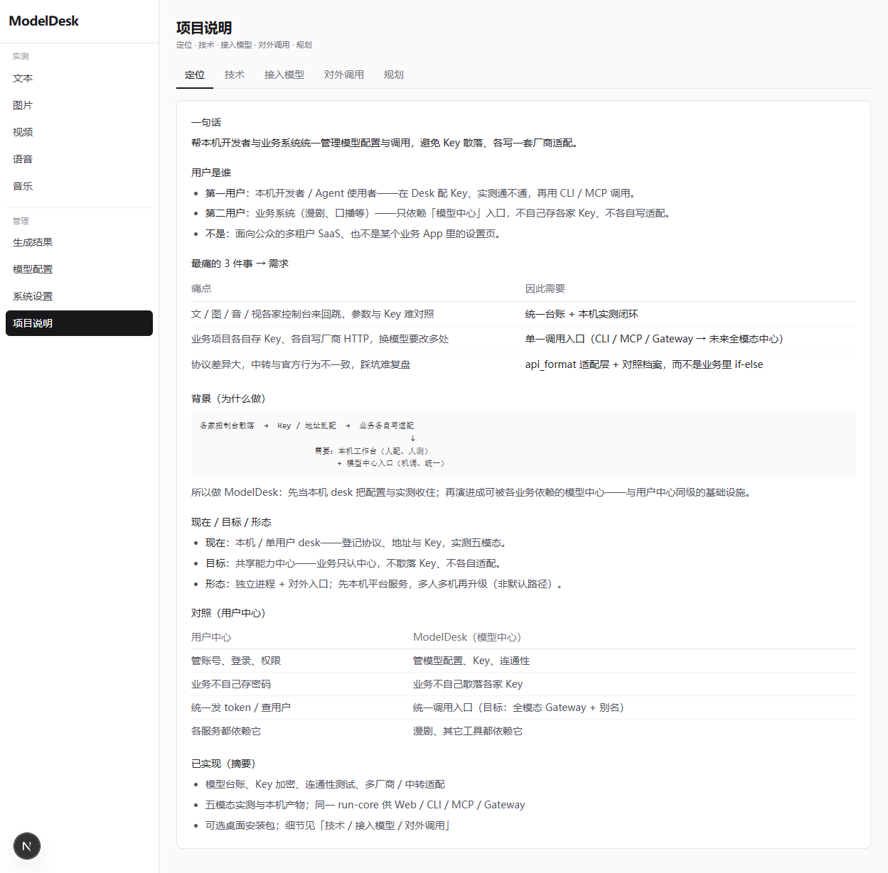
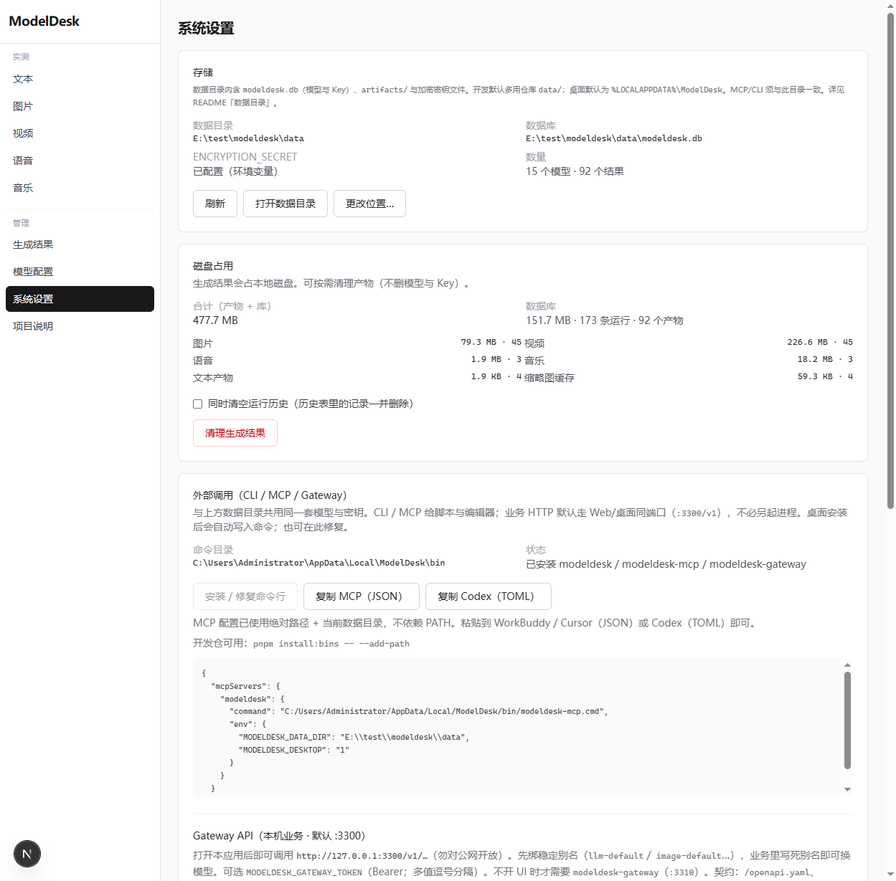
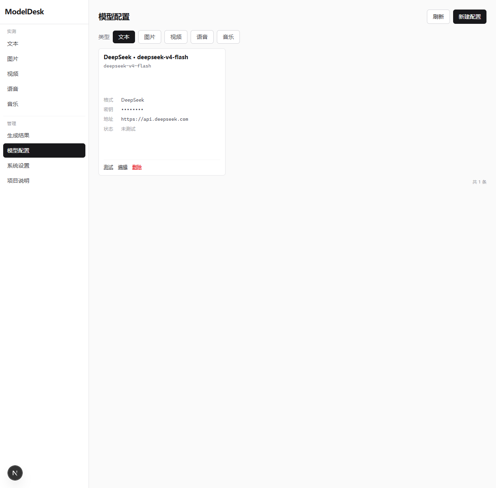
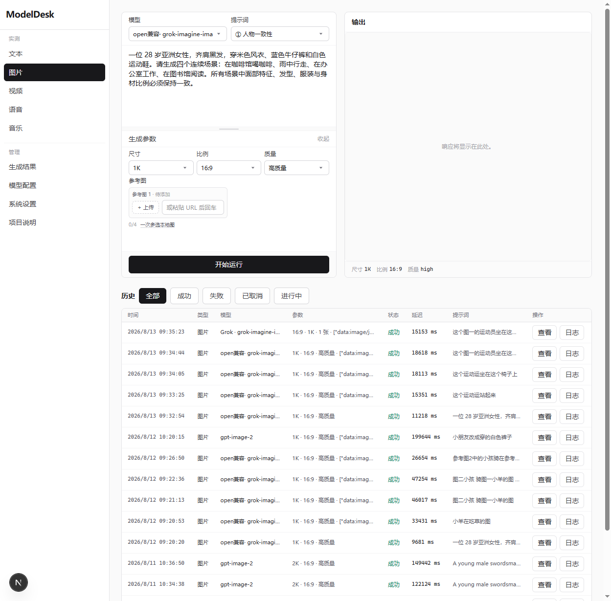
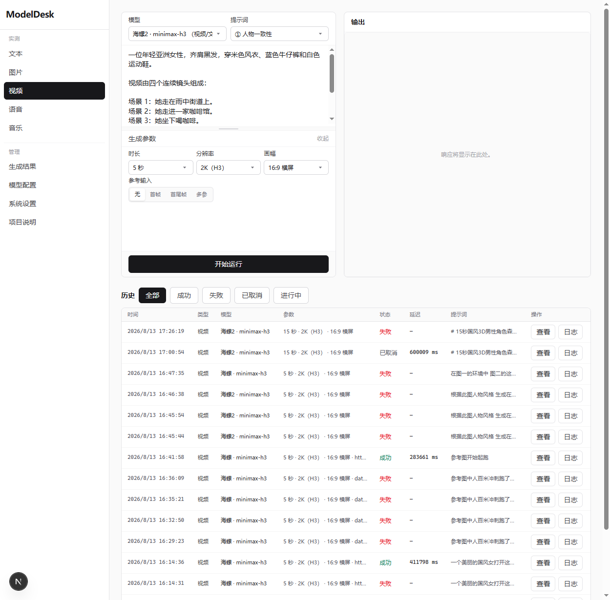
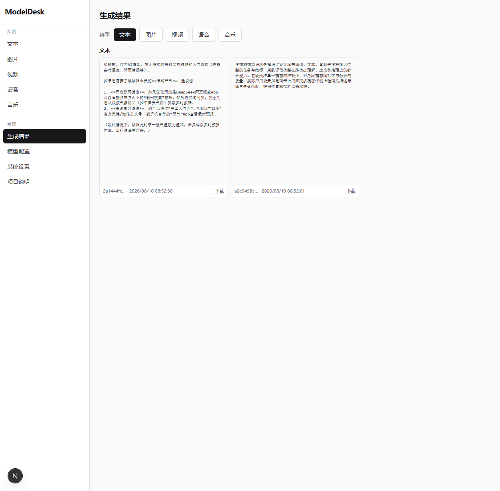

# ModelDesk 操作手册

面向日常使用的图文说明。5 分钟入门可先看 [quickstart-first-image.md](./quickstart-first-image.md)。

截图来自本机界面 `http://127.0.0.1:3300`（桌面端与开发 Web 相同）。

---

## 目录

1. [界面总览](#1-界面总览)
2. [系统设置](#2-系统设置)
3. [模型配置](#3-模型配置)
4. [多模态实测](#4-多模态实测)
5. [生成结果](#5-生成结果)
6. [任务进行中与历史](#6-任务进行中与历史)
7. [对外调用（MCP / CLI / Gateway）](#7-对外调用mcp--cli--gateway)
8. [常见问题](#8-常见问题)

---

## 1. 界面总览

左侧为导航：

| 区域 | 入口 | 用途 |
|------|------|------|
| 实测 | 文本 / 图片 / 视频 / 语音 / 音乐 | 选模型、写提示词、看结果与历史 |
| 管理 | 生成结果 / 模型配置 / 系统设置 / 项目说明 | 产物库、Key、本机环境与说明 |

**项目说明**页可查看定位、技术栈、接入格式与对外调用摘要：

---

## 2. 系统设置

路径：**系统设置**

### 2.1 加密密钥

保存 API Key / 对象存储密钥前，需已配置 `ENCRYPTION_SECRET`。

- 若提示未配置：点 **生成加密密钥**（写入数据目录，不必手改 `.env`）
- 密钥丢失会导致无法解密已存 Key，请勿随意删除数据目录里的密钥文件

### 2.2 数据目录

- 开发默认多为仓库或自定义目录；桌面端默认 `%LOCALAPPDATA%\ModelDesk\`
- 可在设置中查看路径、打开目录、迁移到新路径
- **磁盘占用**可清理生成产物与历史（按需勾选）

### 2.3 对象存储（可选）

部分上游（尤其视频图生 / 多参考）**不接受本地 Base64**，需要公网 URL。

1. 打开「对象存储」开关  
2. 选择厂商（如火山 TOS）  
3. 按输入框**假数据占位**填写 Bucket / Region / Endpoint / Key（真实密钥勿提交到 Git）  
4. **保存配置** → **测试**

未开启时：本地图可能以 data URI 直传，中转站容易 `400 Error when parsing request`。

### 2.4 外部调用

- **复制 MCP（JSON）** 给 Cursor 等 Agent  
- 可选安装命令行入口（`modeldesk` CLI）  
详见 [external-access.md](./external-access.md)

---

## 3. 模型配置

路径：**模型配置**

### 操作步骤

1. 点 **新建配置**（或编辑已有卡片）  
2. 选择模态（文 / 图 / 音 / 视 / 乐）与 **API 格式**  
3. 填写 Base URL、Model ID、API Key  
4. 视频等异步协议可在 **高级** 中填写完整提交 URL / 查询 URL（`{{id}}` 占位）  
5. **保存**；可用 **测试** 做连通性抽检  

### 建议

- 优先选官方文档中的 Base URL；社区中转请显式选对 `api_format`  
- MiniMax 视频中转常见：高级模式提交 `…/v1/videos`，查询 `…/v1/videos/{{id}}`  
- 厂商细节见 [docs/adapters](./adapters/README.md)

---

## 4. 多模态实测

路径：**实测 → 图片 / 视频 / …**

### 4.1 图片

1. 顶部选择已配置的图片模型  
2. 输入提示词；按需改尺寸 / 比例 / 参考图  
3. **开始运行** → 右侧看结果，可下载  
4. 下方 **历史** 可回看、取消进行中任务  

### 4.2 视频

1. 选择视频模型（如 MiniMax H3、智谱、Seedance）  
2. 设置时长、分辨率、画幅；图生视频可加首帧 / 尾帧或「多参」参考（互斥）  
3. 提交后状态会显示排队 / 进度（如 `queued 20%`）  
4. 视频最长等待约 **30 分钟**；切到其它页不会中断本机任务  

> 参考图尽量用公网 URL，或先配好对象存储再上传本地图。

### 4.3 其它模态

文本 / 语音 / 音乐步骤相同：选模型 → 填参数 → 运行 → 历史回看。

---

## 5. 生成结果

路径：**生成结果**

- 按模态筛选，浏览本机产物  
- 支持预览与下载  
- 磁盘过大时到 **系统设置 → 磁盘占用** 清理  

---

## 6. 任务进行中与历史

| 场景 | 行为 |
|------|------|
| 本页刚提交、SSE 连着 | 进度由服务端推送，实时更新 |
| 刷新页面 / SSE 断开 | 自动从进行中任务恢复，并轮询轻量接口 `/api/runs/active`（约 5 秒） |
| 离开实测页 | 任务继续；历史列表 UI 轮询会停，回来再进页面会刷新 |
| 取消 | 历史行或运行区的取消按钮 |

历史列表只在进页、翻页、筛选、任务起止时整页刷新，**不再**用整页列表当状态主通道。

---

## 7. 对外调用（MCP / CLI / Gateway）

同一数据目录下的模型可被：

| 入口 | 说明 |
|------|------|
| MCP | 设置页复制配置；工具含 list / run / cancel |
| CLI | `pnpm cli` 或安装后的 `modeldesk` |
| Gateway | 默认挂在 Web `:3300/v1/*`（OpenAI 风格）；详见 [gateway-business.md](./gateway-business.md) |

完整说明：[external-access.md](./external-access.md)

---

## 8. 常见问题

| 现象 | 建议 |
|------|------|
| 保存 Key 失败 | 先在设置生成加密密钥 |
| 视频/图生 `Error when parsing request` | 配对象存储或改用公网参考图 URL |
| 视频一直「进行中」 | 等进度；超过约 30 分钟会超时；可看历史错误信息 |
| 中转 429 负载饱和 | 换时段或通道重试 |
| 启动白屏很久 | 桌面端首次解压引擎 1～2 分钟；看 `sidecar.log` |
| 想对照厂商协议 | [docs/adapters](./adapters/README.md) |

---

## 相关文档

- [5 分钟跑通第一张图](./quickstart-first-image.md)  
- [对外调用](./external-access.md)  
- [安全说明](../SECURITY.md)  
- [发版说明](./RELEASE.md)  
- 仓库总览：[README.md](../README.md)  
